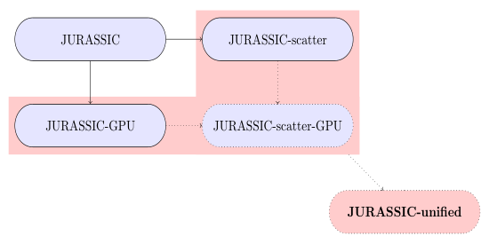
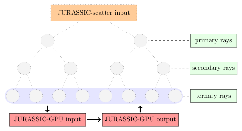
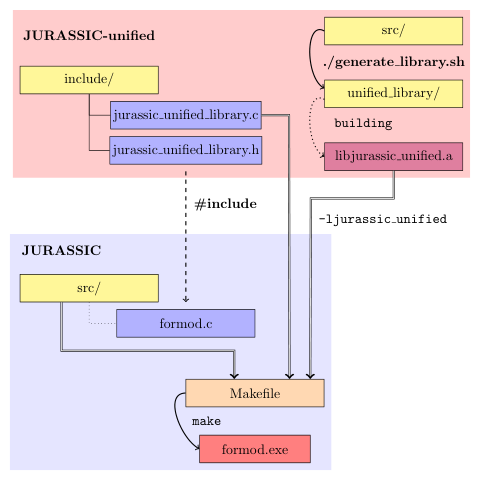

# JURASSIC-unified

## Short description

* JURASSIC-unified has capabilities to simulate scattering of infrared radiation, but also benefits from GPU acceleration.
* Acceleration of simulation of multiple scattering for radiation transport was done by combining the [JURASSIC-scatter](https://github.com/slcs-jsc/jurassic-scatter) and [JURASSIC-GPU](https://github.com/slcs-jsc/jurassic-gpu) projects. 
The radiative transfer simulation for rays from the lowest recursion level from the scattering simulation is similar to the case without scattering, which was accelerated in the JURASSIC-GPU project.
Therefore, in JURASSIC-unified, radiation for rays from higher recursion levels is calculated on the CPU as in JURASSIC-scatter, and for those from the lowest level on the GPU, leveraging the JURASSIC-GPU implementation.

* JURASSIC-unified contains no duplicate code, making the code easy to maintain.
* Because it performs the significant part of the simulation on GPUs, this implementation is around <b>24×</b> faster then the JURASSIC-scatter implementation.

## JURASSIC-unified as a library
* JURASSIC-unified can be used from the [JURASSIC](https://github.com/slcs-jsc/jurassic) reference project as a library.
To do this, first the `generate_library.sh` script, in which the code is adapted, compiled and wrapped into the C static library `libjurassic unified.a`.
This C static library has to be linked when compiling the JURASSIC reference project, but to use it, the files from the `include` folder have to be included into the JURASSIC reference code.

## Documentation
* todo..
